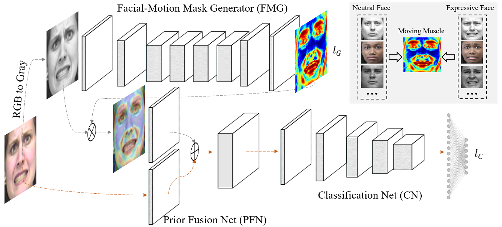

# FMPN-FER

<p align="left">
	
	
	
	
</p>

[](https://paperswithcode.com/sota/facial-expression-recognition-on-mmi?p=facial-motion-prior-networks-for-facial)

[](https://paperswithcode.com/sota/facial-expression-recognition-on-ck?p=facial-motion-prior-networks-for-facial)

Official PyTorch Implementation of **Facial Motion Prior Networks for Facial Expression Recognition** by <a href="https://donydchen.github.io">Yuedong Chen</a>, <a href="https://jianfeng1991.github.io/personal">Jianfeng Wang, <a href="https://www.researchgate.net/profile/Shikai_Chen3">Shikai Chen</a>, Zhongchao Shi, and <a href="https://www.ntu.edu.sg/home/asjfcai/">Jianfei Cai</a>. 
<br>VCIP 2019, Oral, \[[arXiv](https://arxiv.org/abs/1902.08788)\]



## Setup

### Prerequisites

* python >= 3.6
* pytorch >= 0.4.1
* visdom == 0.1.8.9

### Training

The training phase mainly contains two stages, including training the generator for generating facial motion mask, and jointly training the whole recognition network. Running scripts examples are given as below. 

#### Pretrain the Facial-Motion Mask Generator (FMG)

``` sh
python main.py --mode train --data_root datasets/CKPlus --train_csv train_ids_0.csv \
    --print_losses_freq 4 --use_data_augment --visdom_env res_baseline_ckp_0 \
    --niter 150 --niter_decay 150 --gpu_ids 0 \
    --model res_baseline --solver resface --img_nc 1 \
    /
```

#### Jointly Train the Facial-Motion Prior Network

Load the saved weight for the FMG pertained in the previous stage, and ImageNet pretrained weight for the Classifer Net.

```sh
python main.py --mode train --data_root datasets/CKPlus --train_csv train_ids_0.csv \
    --print_losses_freq 4 --use_data_augment --visdom_env res_cls_ckp_0 --niter 100 \
    --niter_decay 100 --gpu_ids 0 --model res_cls --solver res_cls --lambda_resface 0.1 \
    --batch_size 16 --backend_pretrain \
    --load_model_dir ckpts/CKPlus/res_baseline/fold_0/190117_165651 --load_epoch 300 \
    /
```

### Testing 

``` sh
python main.py --mode test --data_root datasets/CKPlus --test_csv test_ids_0.csv \
    --gpu_ids 0 --model res_cls --solver res_cls --batch_size 4 \
    --load_model_dir ckpts/CKPlus/res_cls/fold_0/190118_170050 --load_epoch 200 \
    /
```

## Datasets

* The pseudo ground truth facial motion masks for dataset CK+, MMI and AffectNet are presented in `/datasets`.
* Training and Testing datasets splits are located in `/datasets`, 10-fold cross validation is used in the project as a general approach.

## Results Detail

10 folds accuracy for CK+, MMI and AffectNet.

| Fold ID   | 0     | 1     | 2     | 3     | 4     | 5     | 6     | 7     | 8     | 9     | Avg  |
|-----------|-------|-------|-------|-------|-------|-------|-------|-------|-------|-------|------|
| CK+       | 0.885 | 1.000 | 0.921 | 1.000 | 1.000 | 1.000 | 1.000 | 1.000 | 1.000 | 1.000 | 0.98 |
| MMI       | 0.778 | 0.731 | 0.667 | 0.744 | 0.857 | 0.855 | 0.958 | 0.889 | 1.000 | 0.795 | 0.83 |
| AffectNet | -     | -     | -     | -     | -     | -     | -     | -     | -     | -     | 0.62 |


## Citation

If you use this code for your research, please cite our paper <a href="https://arxiv.org/abs/1902.08788">Facial Motion Prior Networks for Facial Expression Recognition</a>:

```
@article{chen2019facial,
  title={Facial Motion Prior Networks for Facial Expression Recognition},
  author={Chen, Yuedong, Jianfeng Wang, Shikai Chen, Zhongchao Shi, and Jianfei Cai},
  journal={IEEE Visual Communications and Image Processing (VCIP)},
  year={2019},
  organization={IEEE}
}
```

## Acknowledgments

This work is mainly conducted when Yuedong is a research intern in Lenovo AI Lab, Beijing. For any questions regarding this project, feel free to create an issue or reach Yuedong by Email.
